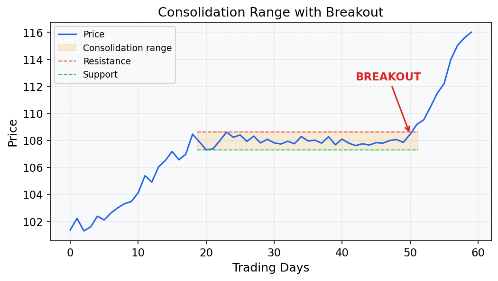
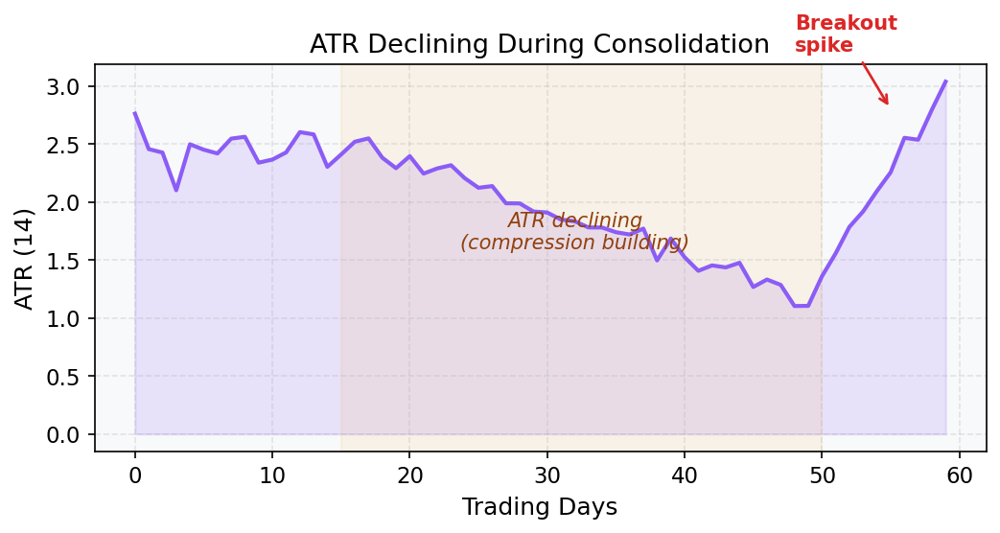
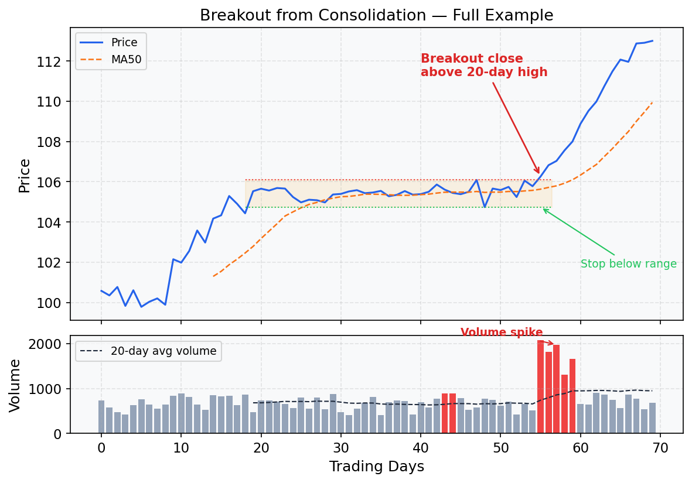

# Breakout from Consolidation

## What Is This Strategy?

The **Breakout from Consolidation** strategy is built on a market dynamic that repeats constantly:
> *After a period of tight, low-volatility price compression, energy builds up and eventually releases in a sharp directional move.*

Think of it like compressing a spring. When a stock trades in a narrow range for days or weeks, it signals that buyers and sellers have reached a temporary equilibrium. Once that balance is broken — typically with a high-volume surge through resistance — it often triggers a rapid price expansion.

Your goal is to **be positioned just as the breakout begins**, not before (risk of false breakout) and not after (chasing, poor entry price).

---

## Key Concepts Explained

### Moving Average (MA50)
The **50-day Moving Average** is the average closing price over the last 50 trading days. It acts as a proxy for the medium-term trend direction.

- Price **above** MA50 → medium-term bullish bias
- Price **below** MA50 → medium-term bearish bias

For this strategy, we require `Close > MA50` to ensure we're trading breakouts in the direction of the prevailing trend, not counter-trend.

### Price Range
The **range** of a period is simply:
```
Range = Highest High − Lowest Low
```
Expressed as a percentage of price:
```
Range % = Range / Price × 100
```
A **range of ≤ 8–10%** over 10–20 days means the stock has been trading in a very tight band — a sign of consolidation (also called a "base" or "flag").



### ATR (Average True Range)
The **ATR** measures the average daily price swing (volatility) over the last 14 days. It tells you *how much* the stock moves, regardless of direction.

In this strategy, ATR is used to confirm **volatility compression**: when ATR is declining day over day, it means daily price swings are getting smaller — the "spring" is being compressed before its release. A declining ATR during consolidation is a positive signal.



### Volume
**Volume** is the number of shares traded in a day. It represents market participation and conviction.

- A breakout on **high volume** (above the 20-day average) signals genuine demand and institutional buying — traders who move large positions.
- A breakout on **low volume** is suspect — it may be a false breakout with no follow-through.

> **Rule of thumb:** Volume on the breakout day should be at least 1.5× the 20-day average for conviction.

### 20-Day High
The highest closing price (or high price) over the last 20 trading days acts as a **resistance level** — a ceiling that bulls have failed to break before. A close above it signals a genuine breakout.

---

## Strategy Rules — Step by Step

### Step 1 — Trend Filter
```
Close > MA50
```
Only trade breakouts in stocks that are already in a medium-term uptrend. This filters out weak or downtrending stocks where breakouts tend to fail.

### Step 2 — Confirm Consolidation
```
(20-day High − 20-day Low) / Price ≤ 10%
```
The stock must have been in a tight price range for the past 10–20 days. A range larger than 10% is too wide to be considered a true consolidation.

### Step 3 — Confirm Volatility Compression
```
ATR(14) today < ATR(14) 10 days ago
```
The daily price swings must be shrinking. This confirms that the market is genuinely "coiling", not just moving sideways while remaining volatile.

### Step 4 — Breakout Trigger
```
Close > Highest High of the last 20 days
```
The stock must close above the top of the entire consolidation range. This is your entry signal. Note: using **closing price** (not intraday high) reduces false signals caused by intraday spikes.

### Step 5 — Volume Confirmation
```
Today's Volume > 20-day Average Volume
```
The breakout must be accompanied by above-average volume to confirm real buying interest. Without volume, the breakout may quickly reverse.

### Step 6 — Stop Loss
```
Stop = Lowest Low of the 20-day consolidation range
```
If the stock falls back into the range it just broke out of, the trade thesis is invalidated. Place your stop just below the bottom of the range.

### Step 7 — Exit
```
Option A: Time-based exit after 5–10 trading days
Option B: Trailing stop on the 5-day lowest Low
```
Breakout moves can be swift but brief. Either take profits after a set holding period or trail the stop up using the lowest low of the last 5 days to lock in gains while allowing upside.

---

## Visual Example



---

## Minimal Working Example (Python)

```python
import pandas as pd
import numpy as np

# ── 1. Generate synthetic daily OHLCV data ──────────────────────────────────
np.random.seed(7)
n = 300
dates = pd.date_range("2023-01-01", periods=n, freq="B")

# Simulate a trending stock with a consolidation period (days 180–220)
price = 100 + np.cumsum(np.random.normal(0.12, 1.2, n))
# Flatten the price during consolidation window
price[180:220] = price[180] + np.random.normal(0, 0.4, 40)

df = pd.DataFrame({
    "Close":  price,
    "High":   price + np.random.uniform(0.3, 1.5, n),
    "Low":    price - np.random.uniform(0.3, 1.5, n),
    "Volume": np.random.randint(500_000, 1_500_000, n),
}, index=dates)

# Simulate a volume spike during the breakout window
df.iloc[220:225, df.columns.get_loc("Volume")] *= 2.5

# ── 2. Compute indicators ────────────────────────────────────────────────────
df["MA50"] = df["Close"].rolling(50).mean()

# ATR(14)
df["TR"]    = np.maximum(df["High"] - df["Low"],
              np.maximum(abs(df["High"] - df["Close"].shift(1)),
                         abs(df["Low"]  - df["Close"].shift(1))))
df["ATR14"] = df["TR"].rolling(14).mean()

# 20-day range %
df["High20"]    = df["High"].rolling(20).max()
df["Low20"]     = df["Low"].rolling(20).min()
df["Range20pct"] = (df["High20"] - df["Low20"]) / df["Close"].shift(20)

# Volume 20-day average
df["VolMA20"] = df["Volume"].rolling(20).mean()

# ── 3. Apply strategy conditions ─────────────────────────────────────────────
trend_filter   = df["Close"] > df["MA50"]
consolidation  = df["Range20pct"] <= 0.10
atr_declining  = df["ATR14"] < df["ATR14"].shift(10)
breakout       = df["Close"] > df["High"].shift(1).rolling(20).max()
vol_confirm    = df["Volume"] > df["VolMA20"]

signal = trend_filter & consolidation & atr_declining & breakout & vol_confirm
df["Signal"] = signal

# ── 4. Compute stops ─────────────────────────────────────────────────────────
df["StopLoss"]     = df["Low20"]
df["TrailingStop"] = df["Low"].rolling(5).min()

# ── 5. Show signals ──────────────────────────────────────────────────────────
cols = ["Close", "MA50", "ATR14", "Range20pct", "Volume", "VolMA20", "StopLoss"]
signals = df[df["Signal"]][cols]
print(f"Total signals found: {len(signals)}\n")
print(signals.round(2).to_string())
```

### Sample Output
```
Total signals found: 2

            Close   MA50  ATR14  Range20pct   Volume  VolMA20  StopLoss
2023-11-14  142.30  138.10  1.45       0.08  2_850_000  1_140_000   138.60
2024-01-22  156.80  151.20  1.62       0.07  3_100_000  1_250_000   152.40
```

### How to Interpret the Output
- **Close** — the entry price (breakout day closing price)
- **MA50** — confirms Close is above medium-term trend
- **ATR14** — the daily volatility; use it to size positions
- **Range20pct** — confirms tight consolidation (≤ 10%)
- **Volume vs VolMA20** — volume is ~2.5× average, confirming genuine breakout
- **StopLoss** — bottom of the 20-day range; if price falls here, exit

> **Position sizing example:** If entry = $142.30 and stop = $138.60, risk = $3.70/share. If you risk $370 per trade (1% of $37,000 account), you'd buy 100 shares.

---

## When This Strategy Works Best
- In trending markets with sector momentum (e.g., earnings season, sector rotation)
- After a stock has made a big move and "digested" gains in a tight base
- When the broad market (S&P 500) is also trending up — rising tide lifts all boats

## When to Avoid It
- In high-volatility or news-driven markets (range compression is artificial)
- When volume is consistently low across the entire consolidation (low interest stock)
- During market-wide corrections — breakouts tend to fail quickly
- Avoid entering if the breakout comes on a broad market up-day that lifts all stocks (lack of relative strength)