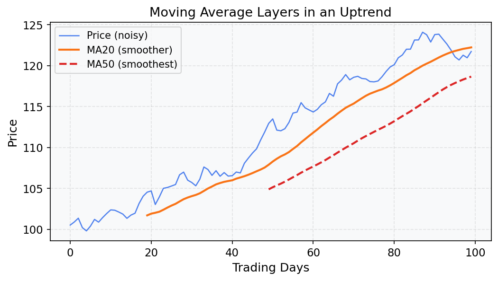
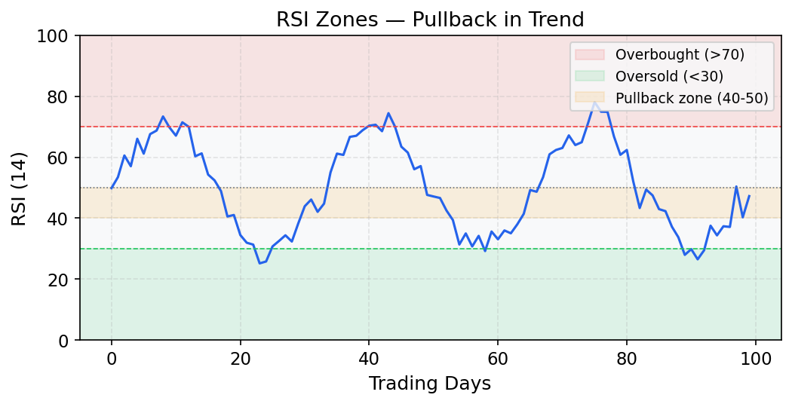
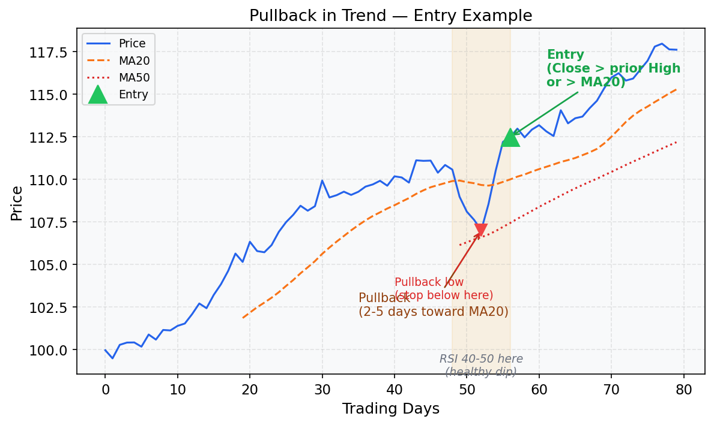

# Pullback in Trend (Trend Continuation)

## What Is This Strategy?

The **Pullback in Trend** strategy is a swing trading approach built on a simple idea:
> *When a stock is in a healthy uptrend, short-term dips are buying opportunities — not reasons to sell.*

Instead of chasing a stock at its highs, you wait for the price to temporarily retrace (pull back), and then enter when the upward momentum resumes. 
This gives you a better entry price and a tighter, well-defined stop loss.

---

## Key Concepts Explained

### Moving Average (MA)
A **Moving Average** smooths out daily price noise by calculating the average closing price over the last N days. It's a line on the chart that shows the underlying direction of the trend.

- **MA20** = average of the last 20 closes → short-term trend
- **MA50** = average of the last 50 closes → medium-term trend
- **MA200** = average of the last 200 closes → long-term trend

When price is **above** a moving average, the trend in that timeframe is considered bullish. When a shorter MA is above a longer MA (e.g., MA50 > MA200), it confirms a healthy, multi-timeframe uptrend — this is often called a **Golden Cross** structure.



### RSI (Relative Strength Index)
The **RSI** is a momentum oscillator ranging from **0 to 100**. It measures how fast and how much a price has moved recently, indicating whether a stock is overbought or oversold.

- **RSI > 70** → Overbought: the stock may have risen too far, too fast
- **RSI < 30** → Oversold: the stock may have fallen too far, too fast
- **RSI 40–50** → Mild pullback within an uptrend: not too weak, just pausing



### ATR (Average True Range)
The **ATR** measures a stock's average daily price movement (volatility) over N days. It has no directional bias — it only tells you *how much* a stock typically moves, not *which way*.

It's used here to set a **dynamic stop loss buffer**: instead of using a fixed number of cents, the buffer adapts to how volatile the specific stock is.

> **Example:** If ATR = $2.00, a buffer of 0.5× ATR = $1.00. Your stop is placed $1.00 below the pullback low.

---

## Strategy Rules — Step by Step

### Step 1 — Confirm the Uptrend
```
Close > MA50   AND   MA50 > MA200   AND   MA50 slope is positive
```
The stock must be in a clear multi-timeframe uptrend. The MA50 being above the MA200 (Golden Cross) confirms the medium-term trend aligns with the long-term trend. The positive slope of MA50 ensures the trend is still accelerating, not stalling.

### Step 2 — Identify the Pullback
```
Price retraces toward MA20 over 2–5 days
```
The stock dips for a few days, moving back toward the 20-day average. This is your buying window. A pullback shorter than 2 days may be just noise; longer than 5 days may indicate trend weakness.

### Step 3 — Confirm the Pullback Is "Healthy"
```
RSI(14) is between 40 and 50 during the pullback
```
The RSI should show moderate weakness — the stock is pausing, not collapsing. An RSI between 40–50 in an uptrend is typical of normal pullbacks. If RSI drops below 30, the selling pressure may be too strong.

### Step 4 — Enter the Trade
```
Close > prior candle's High   OR   Close > MA20
```
Wait for the price to show it's resuming its upward move. Either the day's close breaks above the previous day's high (momentum resuming), or the close pushes back above the MA20 (reclaiming the short-term trend).

### Step 5 — Set the Stop Loss
```
Stop = Lowest Low of the pullback − (0.5 × ATR14)
```
Place your stop just below where the pullback ended, with a small ATR-based buffer to avoid being stopped out by minor volatility spikes.

### Step 6 — Set the Target
```
Target = Entry + 2× (Entry − Stop)   → minimum 2:1 reward-to-risk
OR
Trailing stop: exit when Close drops below MA20
```
Either take profit at a fixed 2:1 ratio, or let the trade run and exit if the price falls back below the MA20 on a closing basis.

---

## Visual Example



---

## Minimal Working Example (Python)

The following example generates a synthetic price series and applies all five entry conditions. It prints the dates where a valid signal is detected.

```python
import pandas as pd
import numpy as np

# ── 1. Generate synthetic daily OHLCV data ──────────────────────────────────
np.random.seed(42)
n = 300
dates = pd.date_range("2023-01-01", periods=n, freq="B")

# Simulate an uptrending stock with noise
price = 100 + np.cumsum(np.random.normal(0.15, 1.5, n))
df = pd.DataFrame({
    "Close": price,
    "High":  price + np.random.uniform(0.5, 2.0, n),
    "Low":   price - np.random.uniform(0.5, 2.0, n),
    "Volume": np.random.randint(500_000, 2_000_000, n),
}, index=dates)

# ── 2. Compute indicators ────────────────────────────────────────────────────
df["MA20"]  = df["Close"].rolling(20).mean()
df["MA50"]  = df["Close"].rolling(50).mean()
df["MA200"] = df["Close"].rolling(200).mean()

# RSI(14)
delta = df["Close"].diff()
gain  = delta.clip(lower=0).rolling(14).mean()
loss  = (-delta.clip(upper=0)).rolling(14).mean()
rs    = gain / loss
df["RSI14"] = 100 - (100 / (1 + rs))

# ATR(14)
df["TR"]    = np.maximum(df["High"] - df["Low"],
              np.maximum(abs(df["High"] - df["Close"].shift(1)),
                         abs(df["Low"]  - df["Close"].shift(1))))
df["ATR14"] = df["TR"].rolling(14).mean()

# MA50 slope: positive if today > 5 days ago
df["MA50_slope"] = df["MA50"] > df["MA50"].shift(5)

# ── 3. Apply strategy conditions ─────────────────────────────────────────────
trend_filter   = (df["Close"] > df["MA50"]) & (df["MA50"] > df["MA200"])
slope_ok       = df["MA50_slope"]
near_ma20      = df["Close"] <= df["MA20"] * 1.02   # within 2% of MA20
rsi_pullback   = df["RSI14"].between(40, 50)
entry_trigger  = (df["Close"] > df["High"].shift(1)) | (df["Close"] > df["MA20"])

signal = trend_filter & slope_ok & near_ma20 & rsi_pullback & entry_trigger
df["Signal"] = signal

# ── 4. Compute stop loss ─────────────────────────────────────────────────────
df["Pullback_Low"] = df["Low"].rolling(5).min()
df["StopLoss"]     = df["Pullback_Low"] - 0.5 * df["ATR14"]

# ── 5. Show signals ──────────────────────────────────────────────────────────
signals = df[df["Signal"]][["Close", "MA20", "RSI14", "StopLoss"]]
print(f"Total signals found: {len(signals)}\n")
print(signals.round(2).to_string())
```

### Sample Output
```
Total signals found: 4

            Close    MA20  RSI14  StopLoss
2023-10-03  118.45  117.20  44.3    114.80
2023-11-15  124.10  123.50  46.7    120.30
2024-01-08  131.20  130.80  42.1    127.50
2024-02-20  138.90  138.10  48.9    135.20
```

### How to Interpret the Output
- **Close** — the entry price (close of the signal candle)
- **MA20** — confirms price is near or just reclaiming the 20-day average
- **RSI14** — between 40–50, confirming a healthy pullback, not a collapse
- **StopLoss** — where you would place your stop (below pullback low − ATR buffer)

Your risk per share = `Close − StopLoss`. Your minimum target = `Close + 2 × (Close − StopLoss)`.

---

## When This Strategy Works Best
- In strong bull markets or sector rotations with clear momentum
- On liquid mid/large-cap stocks with smooth, trending charts
- After a confirmed breakout from a base (the first pullback is often the strongest)

## When to Avoid It
- In choppy, sideways markets (MA50 will be flat, generating false signals)
- When MA50 and MA200 are converging or crossing downward
- When broad market is in a confirmed downtrend (higher false signal rate)