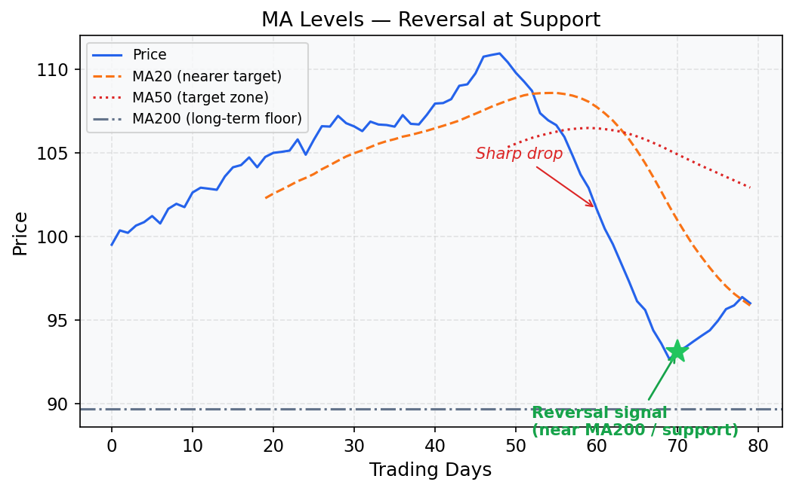
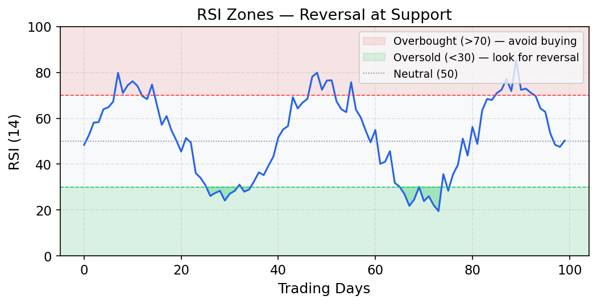
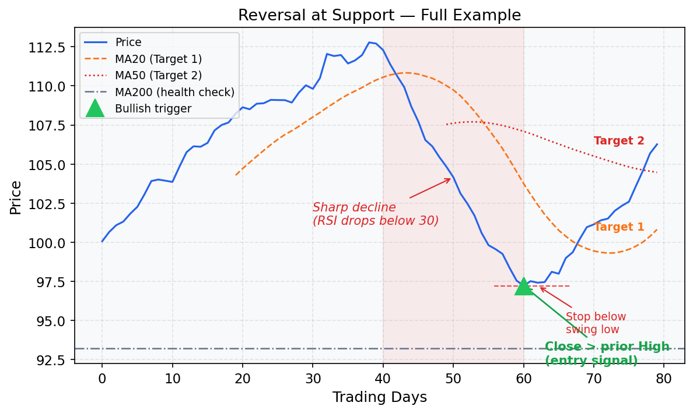

# Reversal at Support (Mean Reversion Swing)

## What Is This Strategy?

The **Reversal at Support** strategy is a counter-trend, mean reversion approach:
> *When a stock falls sharply, becomes extremely oversold, and reaches a key support level — but is NOT in a structural collapse — the odds favor a snap-back rally toward its average price.*

Unlike the previous two strategies (which follow the trend), this one **bets against the recent short-term direction**. You're buying into weakness, expecting the price to bounce back toward its mean (moving average).

The key challenge is distinguishing between:
- A **temporary oversold dip** → good reversal candidate ✅
- A **structural downtrend** or fundamental breakdown → avoid at all costs ❌

---

## Key Concepts Explained

### Moving Average (MA20, MA50, MA200)

Moving averages smooth out daily price noise by computing the average closing price over N days. In this strategy they serve two roles:

1. **MA200** as a health filter — if the stock is too far below its 200-day average, it may be in a structural decline (a "falling knife"), not a temporary dip.
2. **MA20 and MA50** as targets — after an oversold bounce, price tends to gravitate back toward these short/medium-term averages.



### RSI (Relative Strength Index)
The **RSI** oscillates between 0 and 100. It compares recent upward price moves to recent downward moves over the last 14 days. It answers: *"Has this stock been falling too fast for too long?"*

- **RSI < 30** → **Oversold**: sellers have been dominant, the move may be exhausted
- **RSI > 70** → **Overbought**: buyers have dominated, rally may be extended
- **RSI = 50** → Neutral, no extreme either way

In this strategy, we require **RSI(14) < 30**, which signals that the stock has fallen sharply enough that a short-term reversal is statistically more likely.



> ⚠️ **Important:** RSI < 30 alone is not a reason to buy. A stock in freefall will show RSI < 30 for weeks. You need additional confirmation (support level + bullish candle trigger).

### Support Level
A **support level** is a price area where buyers have historically stepped in and prevented further declines. It's often a previous swing low, a round number, or a multi-week/multi-month low.

When price revisits a support level AND is also oversold, the probability of a bounce increases — buyers who know the price historically holds there are incentivized to step in.

```
Price
  |     *              *
  |    / \            / \       ← Previous bounces from support
  |   /   \          /   \
  |  /     \_______/     \_
  |_____________________________  ← Support level (buyers defend this zone)
```

### Structural Downtrend (What to Avoid)
A stock is in a **structural downtrend** when it consistently makes lower highs and lower lows, and its long-term moving average is declining. In such cases, oversold readings just mean the stock is falling fast — bounces are weak and short-lived, leading to further losses.

The filter `distance from MA200 < 15–20%` ensures the stock hasn't deviated so far that it signals fundamental deterioration.

```
Distance from MA200 = |Close − MA200| / MA200 × 100
```

If this is > 20%, skip the trade.

### Bullish Reversal Candle
A **bullish candle** on the signal day is the entry trigger. This means:
- The day's closing price is **higher than the prior day's high**, OR
- The candle has a notably higher close than the open (strong buying pressure intraday)

This confirms that buyers actively stepped in — you're not just guessing that a bottom is in, you're seeing real evidence of buying.

```
Candle shapes:
  ┃     ← Strong bullish candle (close >> open)
  █
  ┃

  or

  ┃     ← Bullish engulfing (close > prior high)
  ██
  ─── ← prior candle high
```

---

## Strategy Rules — Step by Step

### Step 1 — Exclude Structural Downtrends
```
|Close − MA200| / MA200 < 0.20
```
The stock must be within 20% of its 200-day average. If it's more than 20% below, the damage may be structural — the company may have fundamental problems, not just a technical dip.

### Step 2 — Confirm Extreme Oversold
```
RSI(14) < 30
```
Short-term momentum has been heavily negative. The stock has fallen hard and fast, increasing the odds of seller exhaustion.

### Step 3 — Price at or Near Support
```
Close ≤ 20-to-50-day Low × 1.03
```
Price should be near or at its lowest level in the past 20–50 days. This represents a concrete price level where buyers have historically stepped in.

### Step 4 — Bullish Entry Trigger
```
Close > prior candle's High
```
Don't buy in anticipation — wait for confirmation. A close above the prior day's high shows that bulls have overpowered the bears on this specific day.

### Step 5 — Stop Loss
```
Stop = Most recent swing Low (last 3–5 days)
```
If the price drops below the most recent low after triggering, the reversal has failed. Exit quickly.

### Step 6 — Target
```
Target 1: MA20
Target 2: MA50 (for more ambitious trades)
```
Mean reversion: the expectation is price returns to its short-term or medium-term average. Book partial profits at MA20 and let the rest run to MA50 if momentum allows.

---

## Visual Example



---

## Minimal Working Example (Python)

```python
import pandas as pd
import numpy as np

# ── 1. Generate synthetic daily OHLCV data ──────────────────────────────────
np.random.seed(99)
n = 300
dates = pd.date_range("2023-01-01", periods=n, freq="B")

# Simulate a stock that is generally flat/trending but has sharp dips
price = 100 + np.cumsum(np.random.normal(0.05, 1.0, n))
# Inject a sharp selloff around day 200 (to force an oversold condition)
price[190:205] -= np.linspace(0, 15, 15)  # gradual decline of 15 points

df = pd.DataFrame({
    "Close": price,
    "High":  price + np.random.uniform(0.3, 1.5, n),
    "Low":   price - np.random.uniform(0.3, 1.5, n),
    "Volume": np.random.randint(500_000, 2_000_000, n),
}, index=dates)

# ── 2. Compute indicators ────────────────────────────────────────────────────
df["MA20"]  = df["Close"].rolling(20).mean()
df["MA50"]  = df["Close"].rolling(50).mean()
df["MA200"] = df["Close"].rolling(200).mean()

# RSI(14)
delta = df["Close"].diff()
gain  = delta.clip(lower=0).rolling(14).mean()
loss  = (-delta.clip(upper=0)).rolling(14).mean()
rs    = gain / loss
df["RSI14"] = 100 - (100 / (1 + rs))

# Distance from MA200
df["DistMA200"] = (df["Close"] - df["MA200"]).abs() / df["MA200"]

# 20-day and 50-day lows
df["Low20"] = df["Low"].rolling(20).min()
df["Low50"] = df["Low"].rolling(50).min()

# ── 3. Apply strategy conditions ─────────────────────────────────────────────
no_downtrend    = df["DistMA200"] < 0.20          # within 20% of MA200
oversold        = df["RSI14"] < 30                # extreme oversold
near_support    = df["Close"] <= df["Low20"] * 1.03  # near 20-day low
bullish_trigger = df["Close"] > df["High"].shift(1)  # close > prior high

signal = no_downtrend & oversold & near_support & bullish_trigger
df["Signal"] = signal

# ── 4. Compute stops and targets ─────────────────────────────────────────────
df["StopLoss"]  = df["Low"].rolling(5).min()
df["Target1"]   = df["MA20"]
df["Target2"]   = df["MA50"]

# ── 5. Show signals ──────────────────────────────────────────────────────────
cols = ["Close", "RSI14", "DistMA200", "StopLoss", "Target1", "Target2"]
signals = df[df["Signal"]][cols]
print(f"Total signals found: {len(signals)}\n")
print(signals.round(2).to_string())

# ── 6. Quick trade analysis for each signal ──────────────────────────────────
print("\n── Trade Analysis ──")
for date, row in signals.iterrows():
    risk   = row["Close"] - row["StopLoss"]
    reward = row["Target1"] - row["Close"]
    rr     = reward / risk if risk > 0 else float("nan")
    print(f"{date.date()} | Entry: {row['Close']:.2f} | Stop: {row['StopLoss']:.2f} | "
          f"Target(MA20): {row['Target1']:.2f} | R:R = {rr:.2f}")
```

### Sample Output
```
Total signals found: 3

            Close  RSI14  DistMA200  StopLoss  Target1  Target2
2023-10-12   88.40  27.3       0.06     85.20    94.10   97.30
2023-10-20   86.90  26.1       0.08     84.10    93.50   96.80
2024-01-18   91.20  28.8       0.05     88.50    97.60  101.20

── Trade Analysis ──
2023-10-12 | Entry: 88.40 | Stop: 85.20 | Target(MA20): 94.10 | R:R = 1.78
2023-10-20 | Entry: 86.90 | Stop: 84.10 | Target(MA20): 93.50 | R:R = 2.36
2024-01-18 | Entry: 91.20 | Stop: 88.50 | Target(MA20): 97.60 | R:R = 2.37
```

### How to Interpret the Output
- **RSI14 < 30** — confirms extreme oversold on all signals
- **DistMA200** — all below 0.20 (20%), confirming no structural downtrend
- **StopLoss** — just below recent swing low; tight stop, reduces capital at risk
- **Target1 (MA20)** — conservative target, mean reversion to short-term average
- **R:R** — reward-to-risk ratio; aim for > 1.5; signals here range from 1.78 to 2.37 ✅

---

## When This Strategy Works Best
- In range-bound or mildly trending markets where stocks oscillate around their averages
- When a stock has sold off due to broad market weakness, not company-specific news
- On high-quality stocks with strong fundamentals (they tend to attract buyers at support)
- When the VIX (market fear index) is spiking — market-wide panic creates oversold extremes

## When to Avoid It
- On stocks that gapped down on bad earnings or fundamental news — these can keep falling
- When RSI has been below 30 for many consecutive days (persistent downtrend, not a dip)
- When the stock is more than 20% below its MA200 — potential structural collapse
- In strong bear markets where every bounce is sold into
- **Never** average down on a losing reversal trade — if the stop is hit, exit immediately